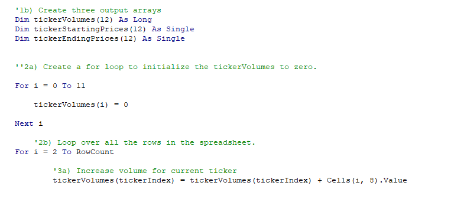

# All Stocks Anlysis
Challenge: Refactoring the All Stocks Analysis macro

## Overview of Project

This VBA macro is designed to analyze the annual performance of multiple stocks, using the year chosen by the user, in order to assist in deciding which stock to invest in. The sample data contains data for 12 stock tickers, over 2 years. Using VBA, I calculated the total annual volume per ticker, as well as the annual percentage return per ticker. Originally, I had calculated these values one ticker at a time using nested for loops. In order to refactor or improve and consolidate the code, I used a faster way to run the anlysis on all tickers at once using output arrays.  

[AllStocksAnalysisRefactored](VBA_Challenge.xlsm)

## Results Analysis

Reviewing the output of the anlysis, in general we see better stock performance in 2017 compared to 2018. With the exception of tickers TERP, ENPH, and RUN, tickers in the anaylsis showed positive returns in 2017, and then negative returns in 2018. Tickers RUN ENPH were the only tickers to show a positive return for both years: ENPH showing decreasing performance in 2018, while RUN was the only ticker with positive returns to increase performance betwen 2017 and 2018. 

With the limited data of stock performance over 2 years, I would recommend investing in the stock RUN which shows increasing growth over the two year period. RUN's total daily volume also increased to $538,024,300 in 2017 which shows increased liquidity. Of course, it would be best to analyze several years including the most recent years to gauge performanace over time as well as identify and discount any abnormal behavior due to unexpected market conditions.

After refactoring the code to use output arrays to analyze the tickers all at once over one For loop, we saw increased performance in code runtimes. The run time for the original macro "AllStocksAnalysis" runs consistently between 1.35 and 1.5 seconds for both 2017 and 2018 data. Refactoring the code improved the speed dramatically, and the newer "AllStocksAnalsyisRefactored" macro runs consistently in under 0.3 seconds. See timestamps from refactored code runs below:

## Summary

The advantages of refactoring code include increased run time due to more efficient code which cuts out unecessary steps. By editing your code, you can consolidate the lines or actions needed and improve the logic which makes it easier for someone else to interpret and add to your code. Refactoring code is essential to creating efficient and well-performing software programs, as many program features build off of the same code and having inefficiently written code with unecessary steps or loops will cause it to run slowly and utilize more system memory than necessary. 

In this scenario analyzing stock tickers, grouping the outputs of tickerVolume, tickerEndingPrices, and tickerStartingPrices as output arrays allowed us to cut out unecessary loops from the first version. See the image below of how the first version, "AllStocksAnalysis," used a nested For loop to run analysis on each ticker one-by-one. 

In this first version, the step to record the output of results in the worksheet occurred inside the original "For i" loop, meaning the calculations were run and recorded on the sheet 12 separate times per ticker index. 

Meanwhile, the refactored version, "AllStocksAnalysisRefactored," pictured below, you can see there are separate For loops to accomplish the same process: one to set each initial ticker volume to zero, and then another to increase volumes and returns for each ticker, and then a 3rd for loop to output all of the data you collected in the 2nd loop at once. This means that the calculations all ran at the same time as opposed to the 1st version where we ran the calculations 12 separate times. 

The improved run times prove that the refactoring exercise was successful and useful in making the all stocks analysis project more efficient. This code could be further improved by changing the way the ticker indexes are identified, allowing for analysis of additional tickers not listed in the current array. 
